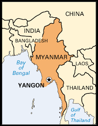
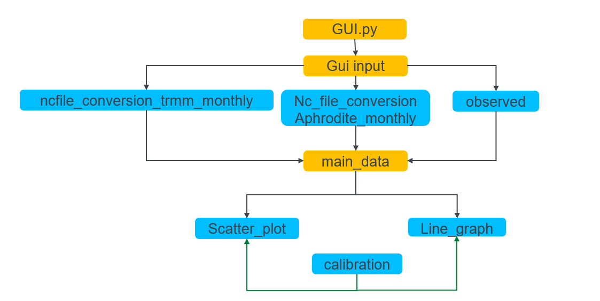
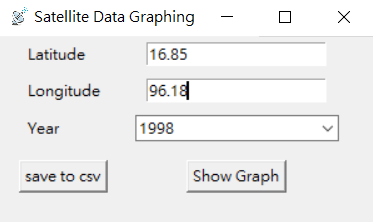

NALU
# Satellite_Precipitation_Data_Analysis_Python
## Satellite Data
TRMM (Tropical Rainfall Measuring Mission) and 
APHRODITE (Asian Precipitation Highly Resolved Observational Data Integration towards Evaluation) 
are the two different satellites which can give the precipitation data, runoff data 
and elevation data for all over the world.
Since the data from satellite are giving for whole area of world, there may have ome errors for small area.
Thus, precipitation data error analysing and calibration the satellite data by comparing with 
observed precipitation data are performed in this project by using Python programming. 

In addition, downloaded satellite data are in NetCDF file(Network Common Data Form, 
file storing format for multidimensional scientific data) and the data are not in easy readable format 
if the user do not use a software for data extracting such as ArcGIS.
Therefore, we used Python programming for data extracting and easy understanding format. 


## Project Goals 
1. To transfer the satellite data to readable and easily understandable figure and statistic
2. To learn the accuracy of the satellite data

In order to accomplish these project goals, we used the two different satellites TRMM and APHRODITE. 
The case study area of this project is Yangon, Myanmar (16.85 latitude, 96.18 Longitude) 
and observed data from this location is also applied for data analysing from 1997 to 2007. 



## Run Instruction 
Run the gui.py file and user need to input latitude, longitude and year.
There are two buttons, one is to show the graphs and
the user can press the save to csv button,
if the user wants to save the downloaded precipitation data as a csv file for two satellites and observed.
After running the code,it will show line graphs and scatter plot charts, comparison of satellite data and observed data for before and after calibration.

*Remark: Observed data is only available for case study location,
16.85 for latitude and 96.18 for longitude. Otherwise, error messages will appear, 
however different location will give some graphs but results might be meaningless.*

## Requirement 
* flussenv
* xarray
* sklearn.matrix
* cftime

### Code Diagram 



## Usage of Function 
### GUI
We import the tkinter for GUI. We create two entry for user to input latitude and longitude.
We create a combobox for user to select available year. 
We use the input information to get the data we need from raw data files.
We create a button that we can ask for the graphs ,and 
we create another button to save the data into csv file if the user wish. 
```python
import tkinter as tk
from tkinter import ttk
from tkinter.messagebox import showinfo
from line_graph import line_graph
from calibration import calibration
from main_data import Aphrodite, Observed, Trmm

x = ['Jan', 'Feb', 'Mar', 'Apr', 'May', 'Jun', 'Jul', 'Aug', 'Sep', 'Oct', 'Nov', 'Dec']
y = [1998, 1999, 2000, 2001, 2002, 2003, 2004, 2005, 2006, 2007]

root = tk.Tk()  # Build GUI basic interface
root.title('Satellite Data Graphing')
root.iconbitmap('data/710satelliteantenna_100238.ico')
root.geometry("300x150")


class CalApp(tk.Frame):  # Build GUI input
    def __init__(self, master, **kw):
        super().__init__(master, **kw)
        self.n1 = tk.DoubleVar()
        self.n2 = tk.DoubleVar()
        self.n3 = tk.IntVar()

        self.lat_label = tk.Label(master, text="Latitude")  # Build GUI latitude label
        self.lat_label.grid(row=1, column=0, stick=tk.W, padx=20)
        self.lon_label = tk.Label(master, text="Longitude")  # Build GUI longitude label
        self.lon_label.grid(row=2, column=0, stick=tk.W, padx=20)
        self.year_label = tk.Label(master, text="Year")  # Build GUI year label
        self.year_label.grid(row=3, column=0, stick=tk.W, padx=20)

        self.lat_box = tk.Entry(master, textvariable=self.n1)  # Build GUI latitude entry for user input
        self.lat_box.grid(row=1, column=1, pady=5)
        self.lon_box = tk.Entry(master, textvariable=self.n2)  # Build GUI longitude entry for user input
        self.lon_box.grid(row=2, column=1, pady=5)
        self.year_box = ttk.Combobox(master, textvariable=self.n3)  # Build GUI year combobox for user selection
        self.year_box.grid(row=3, column=1, padx=5, pady=5)
        self.year_box['values'] = y

        # Build GUI button to show graph
        self.confirm_button = tk.Button(master, text="save to csv", command=lambda: {self.save_to_csv()
                                                                                     }).grid(row=4, column=0,
                                                                                             padx=10, pady=10)
        self.show_graph_button = tk.Button(master, text="Show Graph", command=lambda: [self.get_all(),
                                                                                       self.check_a(),
                                                                                       self.check_t(),
                                                                                       self.show_line_graph(),
                                                                                       self.show_cal()
                                                                                       ]).grid(row=4, column=1,
                                                                                               padx=10, pady=10)

    def get_all(self):  # get all data needed from main_data.py using the input location and year
        lat = self.n1.get()
        lon = self.n2.get()
        year = self.n3.get()

        a_data = Aphrodite()
        t_data = Trmm()
        o_data = Observed()

        a_o = a_data.get_data(lat, lon)
        a_o.columns = y
        a = a_o[year]

        t_o = t_data.get_data(lat, lon)
        t_o.columns = y
        t = t_o[year]

        o_o = o_data.get_data()
        o_o.columns = y
        o = o_o[year]
        return a, t, o

    def save_to_csv(self):  # save to csv function
        lat = self.n1.get()
        lon = self.n2.get()

        a_data = Aphrodite()
        t_data = Trmm()
        o_data = Observed()

        t_data.get_data(lat, lon).to_csv('TRMM.csv', index=False, header=y, sep=',')
        a_data.get_data(lat, lon).to_csv('APHRODITE.csv', index=False, header=y, sep=',')
        o_data.get_data().to_csv('Observed.csv', index=False, header=y, sep=',')

    def check_a(self, **options):  # check if we have the observed data from input latitude
        lat = self.n1.get()

        if lat == 16.85:
            tk.messagebox.showinfo(title=None, message='We have the latitude data!', **options)
        else:
            tk.messagebox.showwarning(title=None, message='only latitude = 16.85 has observed data!'
                                                          ' (no calibration possible)', **options)

    def check_t(self, **options):  # check if we have the observed data from input longitude
        lon = self.n2.get()

        if lon == 96.18:
            tk.messagebox.showinfo(title=None, message='We have the longitude data!', **options)
        else:
            tk.messagebox.showwarning(title=None, message='only longitude = 96.12 has observed data!'
                                                          ' (no calibration possible)', **options)

    def show_line_graph(self):  # show line graph
        line_graph(x, self.get_all()[0], self.get_all()[1], self.get_all()[2], "Line Graph")

    def show_cal(self, **options):  # show calibrated graph
        lat = self.n1.get()
        lon = self.n2.get()

        if lat == 16.85 and lon == 96.18:
            calibration(self.get_all()[0], self.get_all()[1], self.get_all()[2])
        else:
            tk.messagebox.showerror(title=None, message='No observed data!', **options)
            exit()


run = CalApp(root)
root.mainloop()
```
### GUI showcase



## TRMM Data Extraction

We use the xarray package to extract the NetCDF file into pandas dataframe by specific location. 
We create the class to store the data from trmm satellite and 
define one function under the class to extract data from raw data file.
To split the 10 years of data into small list use the function np.array_split.
By using the pd.dataframe, transform the data into pandas dataframe for easier manipulation. 

### APHRODITE Data Extraction
The format of the NetCDF file of APHRODITE satellite is different from TRMM satellite, 
we need to use the different code for data extraction. 
We save the data into csv file since the downloaded satellite data given daily values.

## Observed Data
We import the observed data (xlsx file) and change the data into same format with satellite data. 
```python
import numpy as np
import xarray as xr
import pandas as pd
import glob


class Trmm:  # create Trmm class to store the data from trmm satellite
    def __init__(self):
        self.nc_file_list = glob.glob('data/data/TRMM 1998-2007/*.nc')  # import all trmm data file
        self.data_all = []  # empty list to store data
        self.trmm_list = []  # empty list to store data

    def get_data(self, lat, lon):  # main function to extract data from raw data file

        for nc_file in self.nc_file_list:  # xarray allow us to extract data from selected location
            nc = xr.open_dataset(nc_file)

            trmm = nc['precipitation'].sel(nlon=[lon], nlat=[lat], method='nearest')

            data = trmm.to_dataframe()

            self.data_all.append(float((data['precipitation'])))

        data_spilt = np.array_split(self.data_all, 10)  # split the 10 years of data into small list

        for data in data_spilt:  # transform the daily average to monthly
            monthly_data = data * 732
            self.trmm_list.append(monthly_data)

        trmm = pd.DataFrame(self.trmm_list)  # transform the data into pandas dataframe for easier manipulation

        t_g = trmm.T  # transform the data into same format

        return t_g


class Aphrodite:  # create Aphrodite class to store the data from Aphrodite satellite
    def __init__(self):
        self.nc_file_list = glob.glob('data/data/NC/*.nc')  # import all Aphrodite data file

    def get_data(self, lat, lon):  # main function to extra data from raw data file

        for nc_file in self.nc_file_list:  # xarray allow us to extra data from selected location
            nc = xr.open_dataset(nc_file)

            latitude = [lat]
            longitude = [lon]

            for i, j in zip(latitude, longitude):
                location_data = nc.sel(latitude=i, longitude=j, method='nearest')

                location_data.to_dataframe().to_csv('{0}.csv'.format(nc_file))  # save the extracted data into csv file

            raw_data_list = glob.glob("data/data/NC/*.csv")
            aphrodite_list = []

            for raw_data in raw_data_list:  # sum up the daily precipitation for each month
                df = pd.read_csv(raw_data)
                date = raw_data.split(".")[1]
                m = 0
                while m <= 11:
                    m += 1
                    if m <= 9:
                        data = (df['time'] >= '{0}-0{1}-01'.format(date, str(m))) & (
                                df['time'] <= '{0}-0{1}-31'.format(date, str(m)))
                        mon = list(df['precip'].loc[data])
                        aphrodite_list.append(np.sum(mon))
                    else:
                        data = (df['time'] >= '{0}-{1}-01'.format(date, str(m))) & (
                                df['time'] <= '{0}-{1}-31'.format(date, str(m)))
                        mon = list(df['precip'].loc[data])
                        aphrodite_list.append(np.sum(mon))

            data_spilt = np.array_split(aphrodite_list, 10)
            aphrodite = pd.DataFrame(data_spilt)

            a_g = aphrodite.T  # transform the data into same format

        return a_g


class Observed:  # create observed class to store the observed data
    def __init__(self):
        self.raw_data = "data/data/Observed Data Monthly.xlsx"
        self.y_in = 1997
        self.observed_list = []
        self.data_list = pd.read_excel(self.raw_data)

    def get_data(self):  # transform observed data from data source into same format

        while self.y_in <= 2006:
            self.y_in += 1
            data = self.data_list[self.y_in].tolist()
            self.observed_list.append(data)

        observed = pd.DataFrame(self.observed_list)

        o_g = observed.T  # transform the data into same format

        return o_g


```
## Line Graph
We import the matplotlib.pyplot as plt to create the line graph for comparison of satellite data and observed data. 
```python
import matplotlib.pyplot as plt


def line_graph(x, a, t, o, ty):  # plot monthly precipitation line graph from 3 data sources

    plt.plot(x, a, label="APHRODITE_T", linestyle="-")  
    plt.plot(x, t, label="TRMM", linestyle="-.")
    plt.plot(x, o, label="Observed_T", linestyle=":")

    plt.title('{0}'.format(ty))
    plt.legend()
    plt.show()
```
## Scatter Plot Chart 
We use the sklearn.metrics to calculate r2 score on our plot charts.
For the plotting, use matplotlib.pyplot simply.
We create the empty list to store slope and intercept of the original data for calibration. 
We use the numpy to get the slope and intercept value. 
```python
from sklearn.metrics import r2_score
import matplotlib.pyplot as plt
import numpy as np


def scatter_plot(a, t, o):
    m_value = []  # create empty list to store calibration value
    b_value = []
    c_value = []
    d_value = []
    value = [m_value, b_value, c_value, d_value]

    m, b = np.polyfit(a, o, 1)  # find the slope and intercept of original data using numpy
    c, d = np.polyfit(t, o, 1)

    m_value.append(m)  # store the values  in empty list for further uses
    b_value.append(b)
    c_value.append(c)
    d_value.append(d)

    # plot monthly precipitation scatter plot from 2 data sources vs observed data
    plt.scatter(a, o, color='red', label='APHRODITE')
    plt.annotate("r-squared = {:.3f}".format(r2_score(o, a)), (0, 400), color='red')
    plt.plot(a, m * a + b, color='red', linestyle=':')

    plt.scatter(t, o, color='blue', label='TRMM')
    plt.annotate("r-squared = {:.3f}".format(r2_score(o, t)), (0, 350), color='blue')
    plt.plot(t, c * t + d, color='blue', linestyle=':')

    plt.title('Scatter Plot')
    plt.legend()
    plt.show()
    return value
```
## Calibration
We import the slope and intercept value from previous stage to do the calibration, 
and we create the line graphs and scatter plot charts with calibrated data.
```python
from sklearn.metrics import r2_score
import matplotlib.pyplot as plt
import numpy as np
from scatter_plot import scatter_plot
from line_graph import line_graph


def calibration(a, t, o):
    ty = 'Calibrated Line Graph'
    x = ['Jan', 'Feb', 'Mar', 'Apr', 'May', 'Jun', 'Jul', 'Aug', 'Sep', 'Oct', 'Nov', 'Dec']  # x-axis of line graph

    a_c = []  # create empty list to store calibrated data
    t_c = []

    value = scatter_plot(a, t, o)  # get calibration coefficient from scatter_plot function

    a_c.append(a * value[0] + value[1])  # store the calibrated value into empty list
    t_c.append(t * value[2] + value[3])

    m, b = np.polyfit(o, a_c[0], 1)  # find the slope and intercept of calibrated data using numpy
    c, d = np.polyfit(o, t_c[0], 1)

    line_graph(x, a_c[0], t_c[0], o, ty)  # plot calibrated monthly precipitation line graph from 3 data sources

    # plot calibrated monthly precipitation scatter plot from 2 data sources vs observed data
    plt.scatter(o, a_c, color='red', label='APHRODITE')
    plt.annotate("r-squared = {:.3f}".format(r2_score(o, a_c[0])), (0, 400), color='red')
    plt.plot(o, (m * o + b), color='red', linestyle=':')

    plt.scatter(o, t_c, color='blue', label='TRMM')
    plt.annotate("r-squared = {:.3f}".format(r2_score(o, t_c[0])), (0, 350), color='blue')
    plt.plot(o, (c * o + d), color='blue', linestyle=':')

    plt.title('Calibrated Scatter Plot'.format('year'))
    plt.legend()
    plt.show()
```

## Results and Discussion
According to the analysis results from line graphs and plot charts by comparing with observed data,
TRMM satellite gives more accurate results since before calibration. 
However, after calibration both satellites give the reasonable results 
which are suitable to use for the case study area. 

## Sample Graphs


